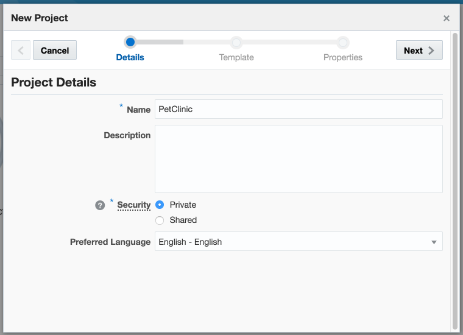
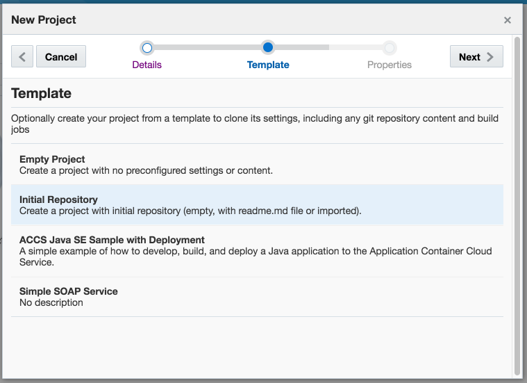
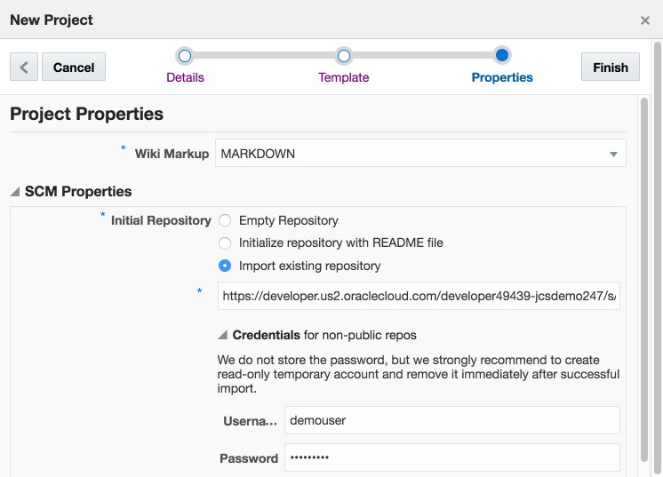
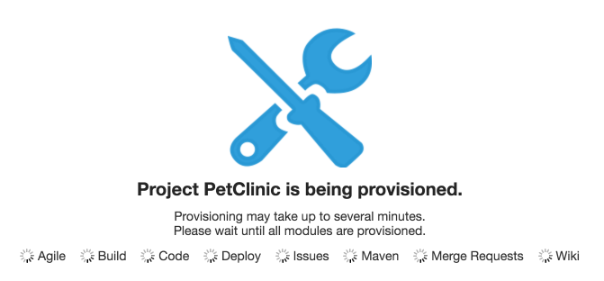
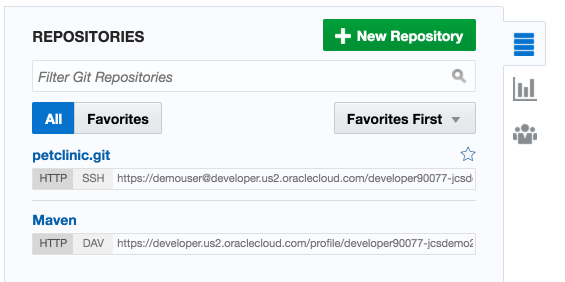
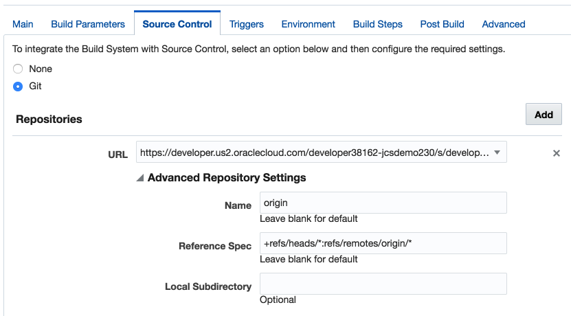
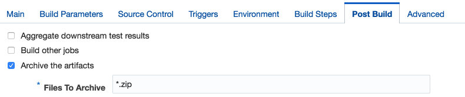
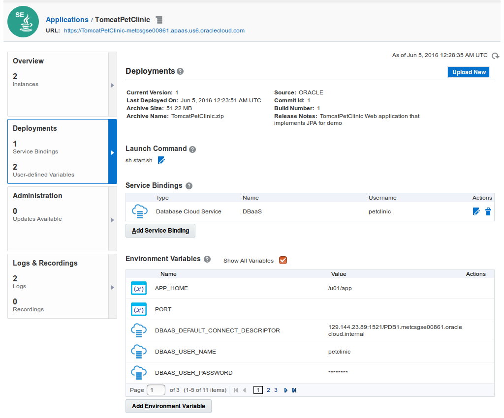
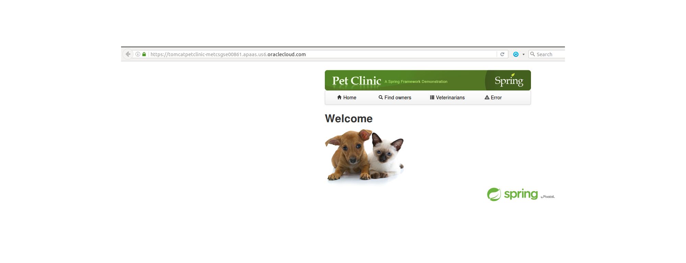

<<<<<<< HEAD
Overview
========

This demo uses Developer Cloud Service to build and deploy the Spring PetClinic running on Tomcat to the Application Container Cloud with data stored in Database Cloud Service.

Prerequisites
=============

Inputs for this demo are:

1. SSH key for DBCS VM
2. Password for DBCS `system` user
3. Oracle.com SSO user id/password for access to the public Oracle Maven Repository required by the build

Setup
=====

Overview:

1. Create DBCS instance
2. Create DevCS project called `PetClinic` cloning the 'golden master' GIT Repository
3. Once created, clone the project GIT repository to your local machine
4. Initialize the Database application user, schema, and contents
5. Encrypt Oracle.com SSO credentials to generate necessary Maven configuration files
6. Commit and push generated Maven credentials to DevCS GIT repository
7. Configure and run DevCS build
8. Define Deployment configuration and deploy

Create DBCS instance
--------------------

Create a DBCS service instance. The name of the service must be `MyDB` to match configuration values used in this example.

Create DevCS PetClinic Project
------------------------------

Create a new project cloning the `golden master` GIT repository that contains the PetClinic sample.

1. Click `New Project` and set the name to `PetClinic` and click `Next`.

2. Select `Initial Repository` and click `Next`.

3. Select `Import existing repository` and provide the URL of the example "master" repository along with the user name and password then click `Finish`.

4. The project will be created and the supporting services provisioned.

Clone project GIT repository
----------------------------

On your local computer, clone the GIT repository of your newly created DevCS project.  You can obtain the repository URL from the project `Home` tab.

Initialize the Database
-----------------------
You'll need the database VM ip address which you can obtain from the service console.

Run `init-dbcs-pdb.sh` to create the `petclinic` application user, tables, and initial contents.  Usage is:

`init-dbcs-pdb.sh <db user> <db password> <ssh key file> <db server ip> [<PDB name>]`

For example:

    $ ./init-dbcs-pdb.sh system ooW_2015 ~/ssh/labkey 129.152.133.104
    create_user.sql                               100%   75     0.1KB/s   00:00    
    initDB.sql                                    100% 1620     1.6KB/s   00:00    
    populateDB.sql                                100% 3254     3.2KB/s   00:00    

    SQL*Plus: Release 12.1.0.2.0 Production on Thu Apr 14 21:12:43 2016

    Copyright (c) 1982, 2014, Oracle.  All rights reserved.

    Last Successful login time: Thu Apr 14 2016 21:03:05 +00:00

    Connected to:
    Oracle Database 12c Enterprise Edition Release 12.1.0.2.0 - 64bit Production

    SQL>
    User created.

    SQL>
    Grant succeeded.

    ...

    SQL> Disconnected from Oracle Database 12c Enterprise Edition Release 12.1.0.2.0 - 64bit Production
    $

When running the init script on a fresh database you'll see some DROP TABLE failures because the script tries to clean up the database if run a second time.  Don't worry about the failure messages the first time you run it.

Encrypt Oracle.com SSO credentials
----------------------------------

This example uses the public Oracle Maven Repository which requires users to accept the terms and conditions and to authenticate when accessed.

To register and accept terms and conditions go to http://www.oracle.com/webapps/maven/register/license.html

Once you have done so you must [use your SSO credentials to access the repository](http://docs.oracle.com/cloud/latest/devcs_common/CSDCS/GUID-2C6E3DAA-E148-4D21-8507-3ECFB99E15C2.htm#CSDCS-GUID-E20C1FB7-FB70-41D9-A664-20387754647B).  This sample provides a utility to get this setup.

After you have cloned the git repo:

1.  Run `setup-mvn-security.sh`
2.  Provide your oracle.com user id
3.  Provide your oracle.com password
4.  The script will generate `settings.xml` and `settings-security.xml` files with your passwords encrypted.

Commit and push generated Maven credentials to DevCS GIT
--------------------------------------------------------

Add the generated `settings.xml` and `settings-security.xml` files to GIT, commit, and push them back to the DevCS GIT repo for use in the build.

    $ git status
    On branch master
    Your branch is up-to-date with 'origin/master'.
    Untracked files:
      (use "git add <file>..." to include in what will be committed)

    	mvn/settings-security.xml
    	mvn/settings.xml

    nothing added to commit but untracked files present (use "git add" to track)
    $ git add mvn/settings-security.xml mvn/settings.xml
    $ git commit -m "credentials"
      [master ea35e47] credentials
      2 files changed, 41 insertions(+)
      create mode 100644 mvn/settings-security.xml
      create mode 100644 mvn/settings.xml
    $ git push
    ...
    Counting objects: 5, done.
    Delta compression using up to 8 threads.
    Compressing objects: 100% (5/5), done.
    Writing objects: 100% (5/5), 956 bytes | 0 bytes/s, done.
    Total 5 (delta 1), reused 0 (delta 0)
    remote: Resolving deltas: 100% (1/1)
    remote: Updating references: 100% (1/1)
    To ssh://..developer.us2.oraclecloud.com/../petclinic.git
    a7939ab..ea35e47  master -> master

Building the Application on Developer Cloud Service
---------------------------------------------------

Once you've created the Maven `settings.xml` and `setting-security.xml` files and pushed your project to the DevCS GIT repo you can build on DevCS by configuring the following build steps.

1. Go to the project `Build` tab.
2. Delete the default build that DevCS may have generated (depending on version)
3. Click `New Job` to create a new build
4. Name the new job "PetClinicBuild" and select `Create a free-style job`.
5. Go to the build's `Main` tab and select `JDK 8` as the JDK to use.
6. Go to the build's `Source Control` tab and select `Git`.

7. Select the project Git repository in the URL drop down.
8. Go to the build's `Triggers` tab and select `Based on SCM polling schedule`.
9. Go to the build's `Build Steps` tab.
10. Click `Add Build Step` and select `Invoke Maven 3`.
11. Set the `Goal` to `-Dsettings.security=mvn/settings-security.xml -s mvn/settings.xml clean package`.  Note the use of the **package** goal--not `install`.

12. Click `Add Build Step` and select `Execute Shell`.
13. Set the `Command` to `sh package.sh`.  This script will zip up the generated artifacts into a deployable application archive.

14. Go to the build's `Post Build` tab.
15. Click `Archive the artifacts`.
16. Set the `Files To Archive` to `*.zip`.

17. Click `Save`.
18. Click `Build Now` to initiate the build.

Creating the Application
------------------------

Because the application environment needs to be configured prior to deployment, we will create a sample application along with the necessary service binding to DBCS. Run `create-application.sh` with your identity domain, user id, and password.

`usage: ./create-application.sh <id domain> <user id> <user password>`

    $./create-application.sh jcsdemo230 demouser demopassword

After the script completes you can log into the ACCS service console and you will see the application being created and, once complete, the service binding to the database.

Deploying the Application from Developer Cloud Service
------------------------------------------------------

Once you have built the application successfully at least once, you can define a deployment configuration to automate deployment to ACCS.

1. Go to the project `Deploy` tab
2. Click `New Configuration`
3. Enter a deployment configuration name, e.g. "PetClinicDeploy"
4. Enter the application name.  This is the name of the application created by `create-application.sh` script, which is `TomcatPetClinic`.
5. Click on the `Deployment Target` field to get a drop down list.  Select your identity domain.
6. For `Type`, select `Automatic`.  This will deploy all successful builds automatically.
7. Select the default build name for the `Job` field.
8. Select the sole zip generated by the build as your `Artifact to deploy`.
9. `Save` the configuration.
10. Once saved, click on the `Gear` menu of the deployment and choose `Redeploy` to deploy the application archive.
11. Choose the last successful build (it should be the default) and click `Deploy`.

Exploring the Application
-------------------------

Navigate to the application by opening the URL provided at the top of the ACCS application details pages.  The base URL will take you to the Spring PetClinic application running inside Tomcat talking to Oracle Database running on DBCS.

All data displayed in the user interface is read and written to the associated DBCS instance.   After you've exercised the application by browsing data you can get a log and see the SQL that the application has been generating.

TomcatPetClinic running on Application Container
------------------------------------------------

